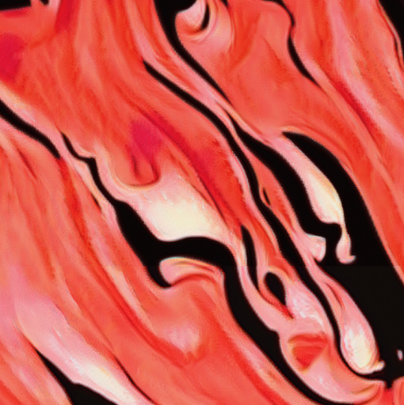

# tileable_texture

In this repository we implement a tileable texture synthesis algorithm, which can theoretically synthesize high resolution textures with an infinite size.

The paper [A Neural Algorithm of Artistic Style](http://arxiv.org/abs/1508.06576) by Gatys et al. hold the beginning of modeling *texture*, or so called *style*, of an image by computing the Gram matrix of features extracted from the pretrained deep CNNs. However, limited by the receptive field size of CNN neurons, the low frequency information and large scale structure can not be modeled.  The paper [High-Resolution Multi-Scale Neural Texture Synthesis](https://doi.org/10.1145/3145749.3149449) introduce a multi-scale synthesis pipeline, which generate better results by match network layers across many scales of a Gaussian pyramid.

However, the maximum size of image that a computer can synthesize is finite due to the restriction of  hardware support. Therefore, we introduce a tileable texture synthesis algorithm, which synthesize the target texture image patch by patch, while maintaining smooth transition in patch edges by a novel *decay mse loss*. So called **tileable** means there are seamless between patches and whole image will be synthesized patch by patch in scanning direction, just like paving tiles.

## results

<table>
	<tr>
		<th valign = 'bottom'><center> Sample Textures </center></th>
        <th><center> Synthesized Textures <br>(thumbnail, original size (4096,4096)) </center></th>
        <th><center> Synthesized Texutres details</center></th>
	</tr>
	<tr>
		<td valign="middle">
			<center></center>
		</td>
        <td>
			<center></center>
		</td>
        <td>
            <center></center>
        </td>
	</tr>
	<tr>
        <td>
            <center></center>
        </td>
        <td>
			<center></center>
		</td>
        <td>
			<center></center>
		</td>
	</tr>
	<tr>
        <td>
            <center></center>
        </td>
        <td>
			<center></center>
		</td>
        <td>
			<center></center>
		</td>
	</tr>
	<tr>
        <td>
            <center></center>
        </td>
        <td>
			<center></center>
		</td>
        <td>
			<center></center>
		</td>
	</tr>
	<tr>
        <td>
            <center></center>
        </td>
        <td>
			<center></center>
		</td>
        <td>
			<center></center>
		</td>
	</tr>
</table>


<table>
	<tr>
		<th valign = 'bottom'><center> Sample Texture </center></th>
		<th>
            <center> Synthesized Texture ( in orignal size (2048,2048) )</center>
        </th>
	</tr>
	<tr>
		<td valign="middle">
			<center></center>
		</td>
        <td>
			<center></center>
		</td>
	</tr>
</table>

### Dependency

- python 3.5 or 3.6
- tensorflow
- VGG19 model weights download from the [TF-slim models](http://download.tensorflow.org/models/vgg_19_2016_08_28.tar.gz) 
- The code is tested on:
  - Ubuntu 16.04 LTS with CPU architecture x86_64 + Nvidia GeForce GTX 1080
  - Windows 10  + Nvidia GeForce GTX 1080

### Getting started 

Denote the directory of this repository as ```./tileable_texture/``` 

- #### Download the VGG19 pre-trained model

```bash
# clone the repository from github
git clone https://github.com/LiaoQian1996/multi_scale_deep_texture.git
cd $tileable_texture/

# download the vgg19 model weights from 
# http://download.tensorflow.org/models/vgg_19_2016_08_28.tar.gz
# to tileable/vgg19/
```

- #### Synthesize  texture image

  ```bash
  python main.py \
      --output_dir result1 \
      --target_dir ./imgs/mottle.png \
      --texture_shape 4096 4096 \
      --top_style_layer VGG54 \
      --max_iter 50 \
      --pyrm_layers 6 \
      --W_tv 0.001 \
      --pad 32 \
      --vgg_ckpt ./vgg19/
      #--print_loss \
  sleep 1
  python patches2img.py --path result
  ```
  
- #### Combine image patches
```bash
python patches2img.py --path result
```

   


